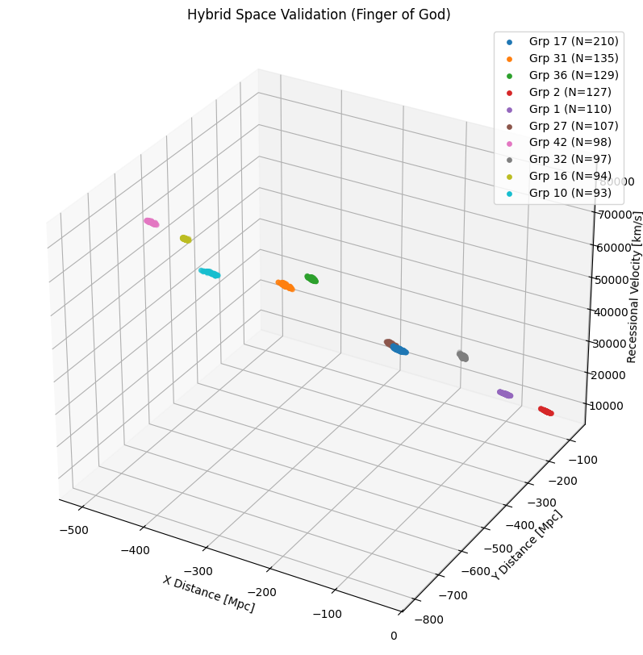

# High-Resolution Mapping of the Cosmic Web (HectoMAP)

## Project Overview
This project implements the **Mulguisin (MGS)** topological clustering algorithm to analyze the large-scale structure of the Universe using data from the **HectoMAP survey**.

The primary objective was to overcome the limitations of standard density-based clustering algorithms (specifically **Friends-of-Friends**), which often suffer from 'over-merging'—accidentally grouping separate systems together into one giant, shapeless blob. By transitioning to MGS, this analysis successfully resolves the complex, filamentary "skeleton" of galaxy clusters and validates their physical nature using topological statistics and phase-space dynamics.

## Key Achievements
* **Algorithm Optimization:** Spearheaded the transition from Friends-of-Friends (FoF) to Mulguisin (MGS), increasing detection yield by **12,000x** (from 3 clusters to 36,253 distinct groups).
* **Topological Analysis:** Developed a statistical pipeline to quantify branching factors, hierarchy depth, and opening angles, mathematically validating the web-like geometry of the universe.
* **Physical Validation:** Visualized **Redshift-Space Distortions (RSD)** in a hybrid phase space to confirm that detected clusters are gravitationally bound systems rather than geometric noise.

## Results Comparison
The transition from FoF to MGS yielded a fundamental improvement in how the data was resolved.

| Metric | Friends-of-Friends (FoF) | Mulguisin (MGS) |
| :--- | :--- | :--- |
| **Algorithm Type** | Fixed Linking Length (Density) | Graph-Theoretic (Voronoi/Delaunay) |
| **Galaxies Processed** | 112,701 | 98,175 (Strict Filtering) |
| **Clusters Found (N≥10)** | **3** (Severe Percolation) | **36,253** (High Resolution) |
| **Structure Type** | Massive, shapeless blobs | Filamentary, multi-generational trees |
| **Validation Method** | None | Redshift-Space Distortion (RSD) |

## MGS


## Repository Structure
```text
HectoMAP-Cosmic-Web-Topology/
├── README.md                # Project documentation
├── requirements.txt         # Python dependencies
├── notebooks/
│   ├── data_info.ipynb   # Visualizes the raw .fits data structure
│   ├── analysis_mgs.ipynb   # Main pipeline: Data cleaning, MGS clustering, Topology
│   └── comparison_fof.ipynb # Baseline comparison: FoF clustering issues
└── img/
    ├── rsd_phase_space.png  # Visualization of Redshift-Space Distortions
    └── topology_stats.png   # 8-panel topological histogram
